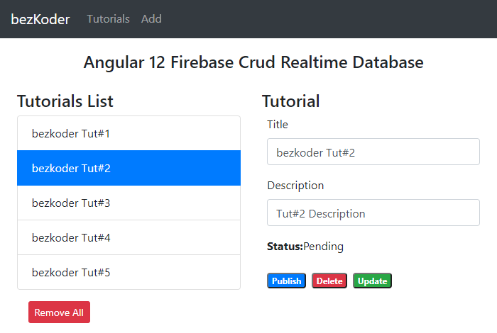

# Angular 12 Firebase CRUD example with Realtime DataBase | AngularFireDatabase

Build Angular 12 CRUD App with Firebase Realtime Database that uses `AngularFireDatabase` service.

- Each Tutorial has key, title, description, published status.
- We can make CRUD operations: create, retrieve, update, delete Tutorials.

For more detail, please visit:
> [Angular 12 Firebase CRUD Realtime DataBase | AngularFireDatabase](https://www.bezkoder.com/angular-12-firebase-crud/)

More Practice:
> [Angular 12 Firestore CRUD example with AngularFireStore](https://www.bezkoder.com/angular-12-firestore-crud-angularfirestore/)

> [Angular 12 Firebase Storage: File Upload/Display/Delete example](https://www.bezkoder.com/angular-12-file-upload-firebase-storage/)

> [Angular 12 CRUD Application example with Web API](https://www.bezkoder.com/angular-12-crud-app/)

> [Angular 12 Form Validation example (Reactive Forms)](https://www.bezkoder.com/angular-12-form-validation/)

Fullstack with Node Express:
> [Angular 12 + Node Express + MySQL example](https://www.bezkoder.com/angular-12-node-js-express-mysql/)

> [Angular 12 + Node Express + PostgreSQL example](https://www.bezkoder.com/angular-12-node-js-express-postgresql/)

> [Angular 12 + Node Express + MongoDB example](https://www.bezkoder.com/angular-12-mongodb-node-js-express/)

Fullstack with Spring Boot:
> [Angular 12 + Spring Boot + H2 Embedded Database example](https://www.bezkoder.com/angular-12-spring-boot-crud/)

> [Angular 12 + Spring Boot + MySQL example](https://www.bezkoder.com/angular-12-spring-boot-mysql/)

> [Angular 12 + Spring Boot + PostgreSQL example](https://www.bezkoder.com/angular-12-spring-boot-postgresql/)

> [Angular 12 + Spring Boot + MongoDB example](https://www.bezkoder.com/angular-12-spring-boot-mongodb/)

Fullstack with Django:

> [Angular 12 + Django Rest Framework](https://www.bezkoder.com/django-angular-12-crud-rest-framework/)

## Development server

Run `ng serve` for a dev server. Navigate to `http://localhost:4200/`. The app will automatically reload if you change any of the source files.

## Code scaffolding

Run `ng generate component component-name` to generate a new component. You can also use `ng generate directive|pipe|service|class|guard|interface|enum|module`.

## Build

Run `ng build` to build the project. The build artifacts will be stored in the `dist/` directory.

## Running unit tests

Run `ng test` to execute the unit tests via [Karma](https://karma-runner.github.io).

## Running end-to-end tests

Run `ng e2e` to execute the end-to-end tests via a platform of your choice. To use this command, you need to first add a package that implements end-to-end testing capabilities.

## Further help

To get more help on the Angular CLI use `ng help` or go check out the [Angular CLI Overview and Command Reference](https://angular.io/cli) page.
